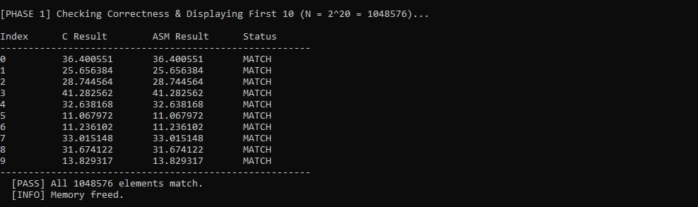
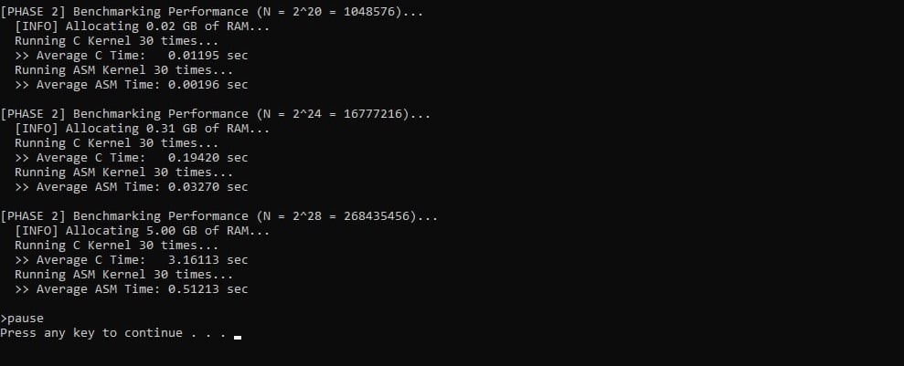

# MP2: x86-64 Assembly vs C Kernel (Euclidean Distance)

#### Members:
- Marvin Ivan Mangubat
- Jeremy James Tan

#### [Link to Demo Video](LINK)

---

## Project Overview
This project compares the performance of a C kernel versus an x86-64 Assembly kernel in calculating the Euclidean distance between two vectors. The kernels were tested against three different vector sizes ($2^{20}$, $2^{24}$, and $2^{28}$) to analyze execution time and consistency. Please note that, due to RAM constraints, we were only able to utilize a maximum of N = 28.

---

## 1. Correctness Check

Before running the performance benchmarks, the kernels were tested for correctness using a vector size of $N = 2^{20}$. The first 10 elements of the C kernel and x86-64 Assembly kernel were compared, showing a **MATCH** for all indices.


*(Figure 1: Program output showing the first 10 results matching between C and Assembly)*

---

## 2. Performance Results

The following table shows the average execution time (calculated over 30 runs) for both kernels across three different vector sizes.

| Vector Size (N) | C Kernel (Avg Time) | ASM Kernel (Avg Time) | Speedup Factor |
| :--- | :--- | :--- | :--- |
| **$2^{20}$** (1,048,576) | 0.01195 sec | 0.00196 sec | **6.1x Faster** |
| **$2^{24}$** (16,777,216) | 0.19420 sec | 0.03270 sec | **5.9x Faster** |
| **$2^{28}$** (268,435,456) | 3.16113 sec | 0.51213 sec | **6.2x Faster** |


*(Figure 2: Console output showing the timing results for all vector sizes)*

---

## 3. Analysis of Results

We can see that the **x86-64 Assembly kernel consistently outperforms the C kernel** by a significant margin (approximately **6x faster**) across all data sizes.

### How can we say that the Assembly version is faster?

1.  **Register Usage vs. Memory Access:**
    The Assembly implementation manually optimizes register usage. By loading the array pointers into registers (`r11`, `r12`, `r13`, `r14`, `rsi`) and performing the arithmetic (`subss`, `mulss`, `addss`, `sqrtss`) entirely within the XMM registers (`xmm0`, `xmm1`), we drastically reduce the number of times the CPU has to interact with RAM or the stack.

    In contrast, the C compiler often generates code that moves variables back and forth between the stack memory and registers for every operation in the loop, creating a bottleneck.

```
for (long long i = 0; i < n; i++) {
    float diffX = x2[i] - x1[i];
    float diffY = y2[i] - y1[i];
    z[i] = sqrtf((diffX * diffX) + (diffY * diffY));
}
```

2.  **Instruction Efficiency:**
    The Assembly kernel utilizes Scalar SIMD instructions directly. It calculates the distance with a tight sequence of instructions without the overhead of maintaining a high-level language stack frame or checking loop bounds with the same complexity as the generated C code.

```
loop_start:
    cmp rbx, r10        ; compare i with n
    jge loop_end        ; if i >= n, exit loop

    ;calculate (x2 - x1)^2 
    movss xmm0, [r12 + rbx*4]   ; xmm0 = x2[i]
    subss xmm0, [r11 + rbx*4]   ; xmm0 = x2[i] - x1[i]
    mulss xmm0, xmm0            ; xmm0 = (x2 - x1)^2

    ;calculate (y2 - y1)^2
    movss xmm1, [r14 + rbx*4]   ; xmm1 = y2[i]
    subss xmm1, [r13 + rbx*4]   ; xmm1 = y2[i] - y1[i]
    mulss xmm1, xmm1            ; xmm1 = (y2 - y1)^2

    ; combine then root
    addss xmm0, xmm1            ; xmm0 = (diffX^2) + (diffY^2)
    sqrtss xmm0, xmm0           ; xmm0 = sqrt( ... )

    ;store result
    movss [rsi + rbx*4], xmm0   ; z[i] = xmm0

    inc rbx                     ; i++
    jmp loop_start
```

3.  **Scalability:**
    The speedup factor remains consistent (~6x) regardless of the vector size. This indicates that the performance advantage is intrinsic to the instruction efficiency and memory access patterns of the Assembly code, rather than just being an artifact of a specific dataset size. However, it's still important to consider that this performance is heavily dependent on the underlying hardware. If we were to run this code using a much faster computer, how much faster the Assembly kernel would be compared to the C kernel may be different from the results we found.